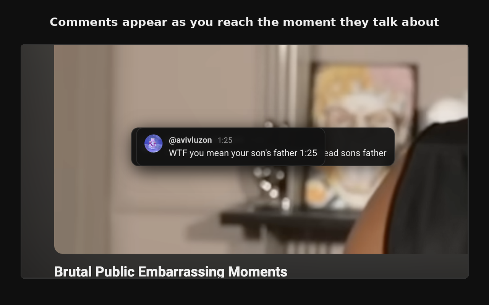

# Comment Markers for YouTube

A Chrome extension that reads the comments on the YouTube video you're watching,
finds every timestamp people mention (`1:23`, `01:23`, `1:02:03`), and marks
those moments on the player's progress bar. As the video plays, each comment
pops up when playback reaches the moment it's talking about — the way comments
appear on a SoundCloud waveform.



## Why

The best moment in a 20-minute video is usually named in the comments, and the
comments are the one place you can't see while watching. This puts them back on
the timeline where they belong.

## Install

**From source (unpacked):**

1. Download or clone this repository
2. Open `chrome://extensions`
3. Turn on **Developer mode** (top right)
4. Click **Load unpacked** and select this folder
5. Open any YouTube video

## Using it

- **Ticks on the progress bar** mark every moment a comment refers to. Taller
  ticks mean several people mentioned that spot.
- **Hover the timeline** to read every comment for that moment, stacked in one
  card above YouTube's own preview thumbnail.
- **While playing**, each comment appears on its own and fades after a few
  seconds. Pause and it stays up as long as you need; press play and it clears.
- **Optional avatars** float above each marker so you can see who's talking.

Click the toolbar icon for quick toggles, or **All settings** for the full list.

## Settings

| Setting | What it does |
| --- | --- |
| Extension enabled | Master on/off |
| Marker colour | Colour of the timeline ticks |
| Tiny avatars on the timeline | Float a commenter avatar above each marker |
| Avatar size | 6–26px |
| Auto-popup while playing | The SoundCloud-style popups |
| Always centre the popup | Pin popups to the middle of the player |
| Popup duration | How long a comment stays on screen |
| Comments to scan | How deep to page through the comment list |
| Max markers shown | Cap; the most-liked comments win |
| Minimum likes | Filter out low-signal comments |
| Debug logging | Print what was found to the page console |

Settings save as you change them. Reload the YouTube tab to apply.

## How it works

- `src/inject.js` runs in the page's main world purely to read YouTube's
  `ytcfg` object (the InnerTube API key and client context).
- `src/content.js` calls YouTube's own `/youtubei/v1/next` endpoint to page
  through the comments — so you don't have to scroll to load them — and falls
  back to scraping already-rendered comments from the DOM if that ever breaks.
- Timestamps landing at roughly the same moment are grouped into one cluster and
  drawn as a single tick. The most-liked comment leads.
- Markers never capture the pointer, so YouTube's own scrub preview keeps
  working. The comment card is positioned against that preview so the two move
  together, including at the very start and end of the bar.
- A comment containing more than four timestamps is treated as a chapter list
  and drawn fainter, so chapter dumps don't drown out real reactions.

## Privacy

The extension collects nothing, sends nothing anywhere, and has no analytics.
The only network requests are to YouTube itself, from the page you're already
on. Settings live in `chrome.storage.sync`. Full policy: [docs/privacy.html](docs/privacy.html).

Permissions used:

- `storage` — remembering your settings
- `https://www.youtube.com/*` — reading the comments of the video you're
  watching and drawing markers on its player

## Project layout

```
manifest.json               MV3 manifest
popup.html / popup.js       toolbar popup (quick toggles + rescan)
options.html / options.js   settings page
src/inject.js               main-world config reader
src/content.js              comment fetch, parsing, markers, popups
src/styles.css              marker and card styling
icons/                      16/32/48/128 px
docs/                       privacy policy (GitHub Pages)
store/                      Chrome Web Store listing assets
```

## Contributing

Issues and pull requests welcome. There's no build step — it's plain JavaScript,
HTML and CSS. Edit the files, reload the extension at `chrome://extensions`, and
reload your YouTube tab.

## Licence

MIT — see [LICENSE](LICENSE).

## Disclaimer

Not affiliated with, endorsed by, or sponsored by YouTube or Google LLC.
YouTube is a trademark of Google LLC.
